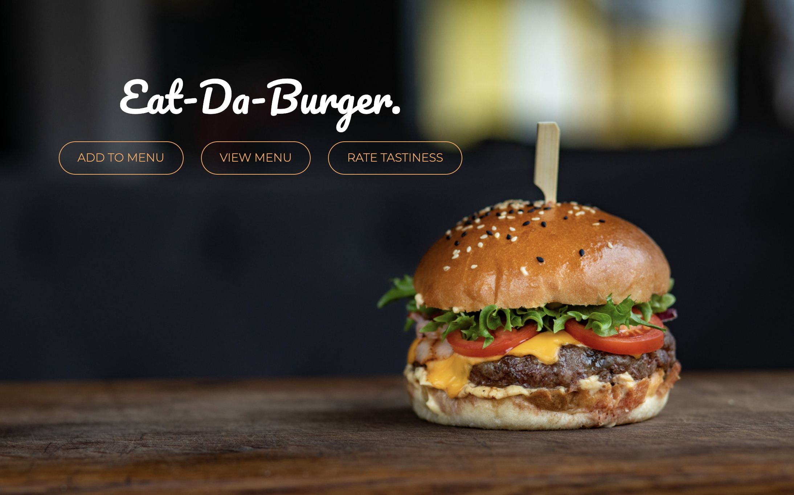
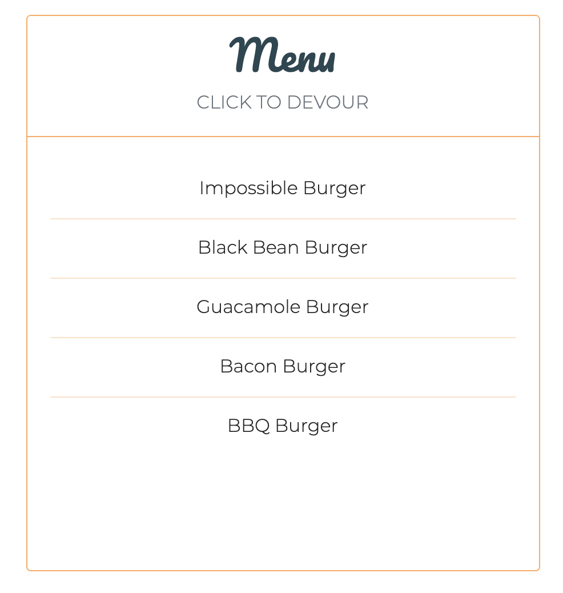
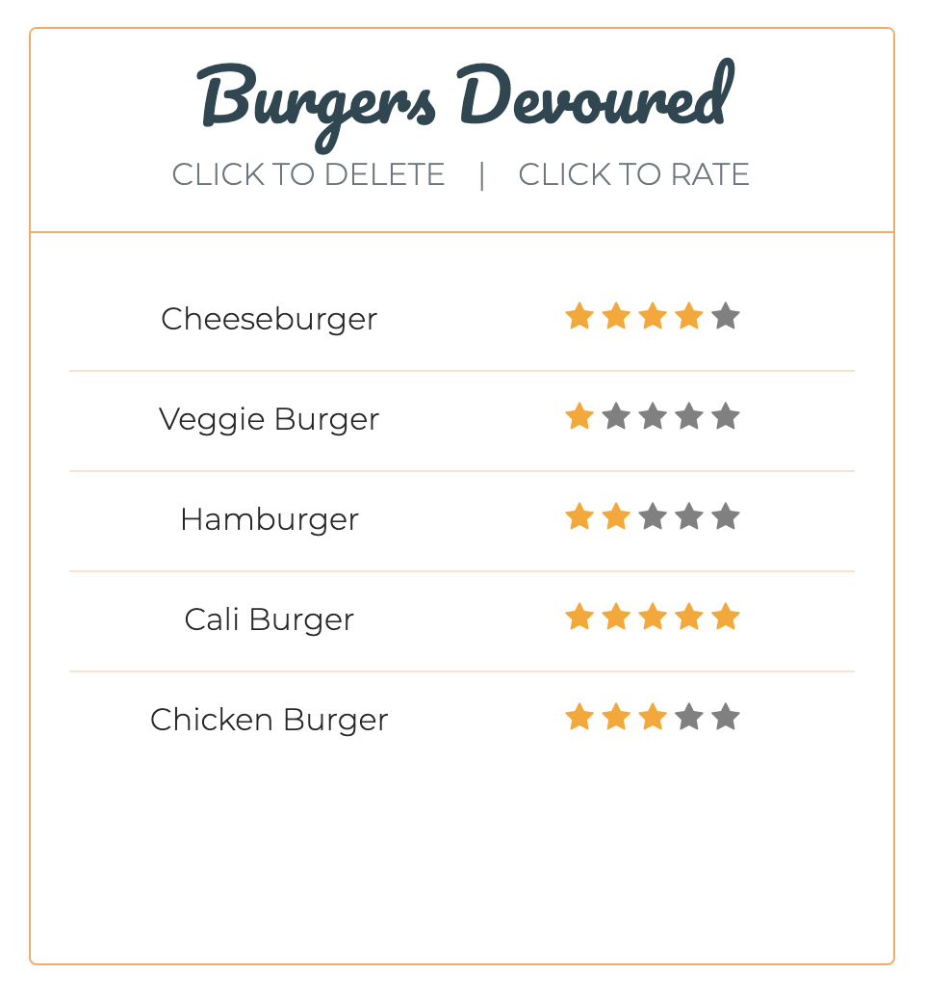
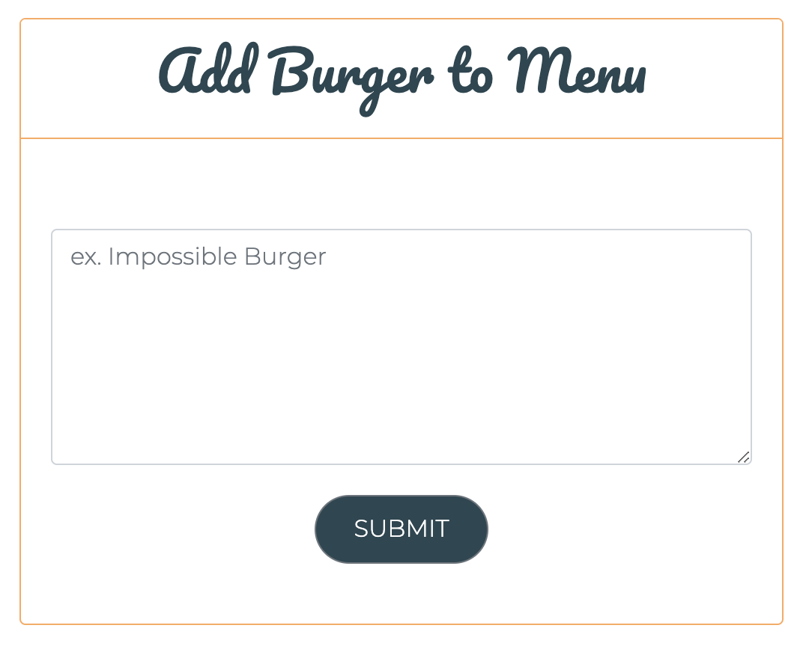

# [Eat-Da-Burger](https://jp-burger-logger.herokuapp.com/) 

## Description
Eat-Da-Burger is a full-stack, restaurant application that allows the user to track and store information about items on their menu, using a MySQL database. The user is able to view items currently on the menu, or add their own new items. When the user clicks on a burger from the menu, the burger is devoured and moved to the devoured list. Once the item is on the devoured list, the user can rate it's tastiness using the stars beside the burger of their choice. If a burger is unworthy of a rating, the user can choose to delete it by clicking on that item.

This application was built using MySQL, Node, Express, Handlebars, JavaScript, and a homemade ORM. The structure of the codebase follows the MVC design pattern, by breaking up code that is concerned with the Model (our database and it's logic), View (what the user sees and interactions with), and Controller (the logic that allows our View and Model to speak to eachother) of the application. Eat-Da-Burger is a true full-stack application, that allows the user to create, retrieve, update, and delete data from a MySQL database, through a graphical user-interface.

Building this application taught me about how working with the MVC design pattern can simplify the code writing process, by breaking our application up into modules that are easier to tackle and test. I learned how working with an ORM can help us write lesss code and simplify data insertion and retrieval from a database. I also learned how to utilize a templating engine, like Handlebars, to automatically generate the view of an application that is responsive to user input and requests. Ultimately the biggest thing I learned from building this app, was how to bring all of these different pieces together, in an organized way, to create a full-stack web application.

 

 

## Table of Contents
* [Technologies](#technologies)
* [Usage](#usage)
* [Finished Product](#finished-product)
* [Credits](#Credits)
* [Questions](#questions)

## Technologies
* MySQL
* Handlebars
* JavaScript
* Node.js
* Express.js
* Heroku
* HTML
* CSS
* Bootstrap

## Usage
* Navigate to the [deployed Heroku App](https://jp-burger-logger.herokuapp.com/).
* Click 'View Menu' button to view burgers currently on the menu.
* Click the 'Add to Menu' button to add any burger you'd like to the menu.
* Devour a burger by clicking on it, burger is then added to devoured list.
* Once a burger has been devoured, you may click on it to delete it, or rate it's tastiness using the stars on the right hand side.

## Finished Product
View deployed Heroku app [here](https://jp-burger-logger.herokuapp.com//).  
View application through my portfolio page [here](https://jpreston-alt.github.io/Portfolio/portfolio.html).

## Credits
* Background image by [Valeria Boltneva](https://www.pexels.com/@valeriya) from Pexels.

## Questions
​
If you have any questions about the repo, please contact me:

On GitHub: [jpreston-alt](https://github.com/jpreston-alt) | Via Email: joannappreston@gmail.com